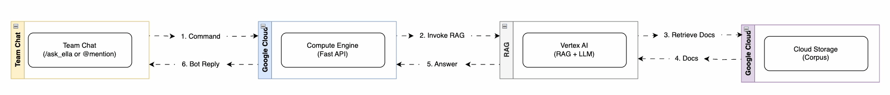
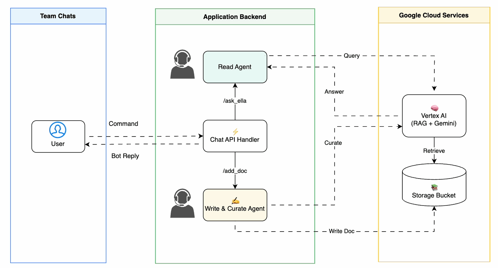
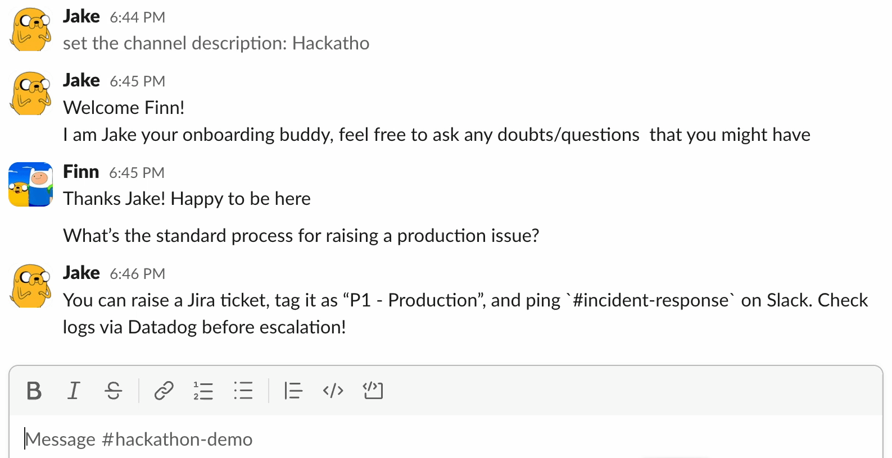
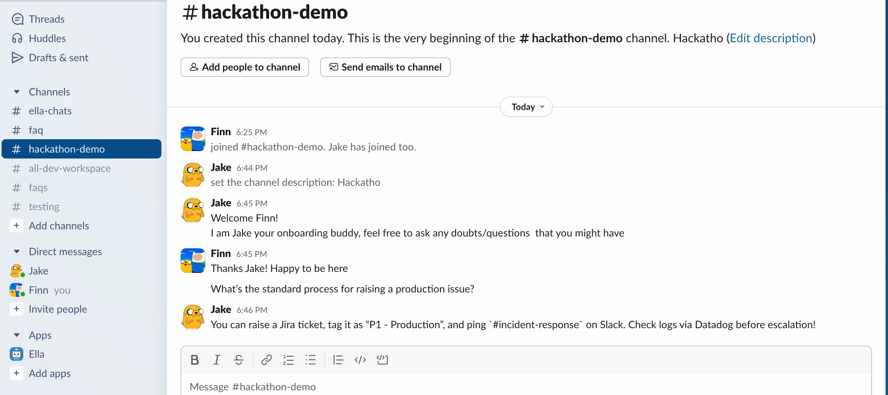
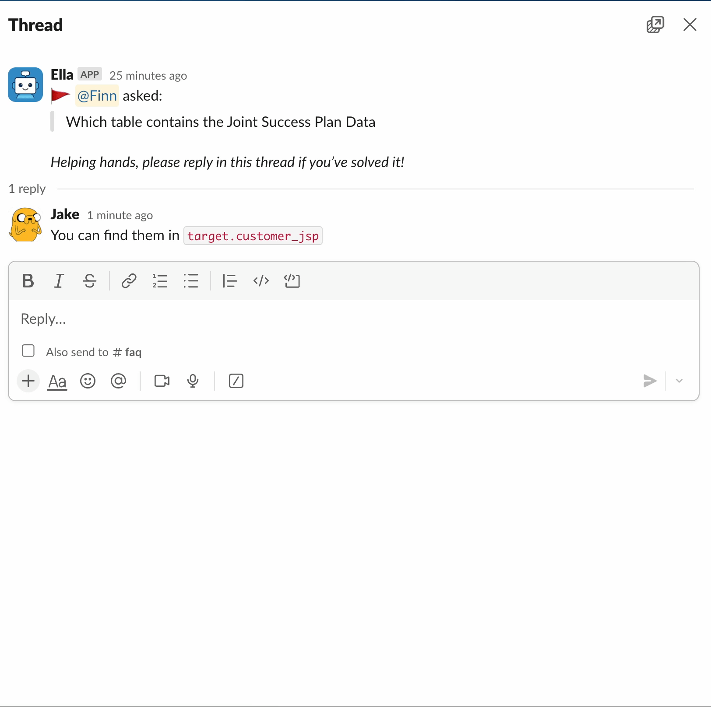
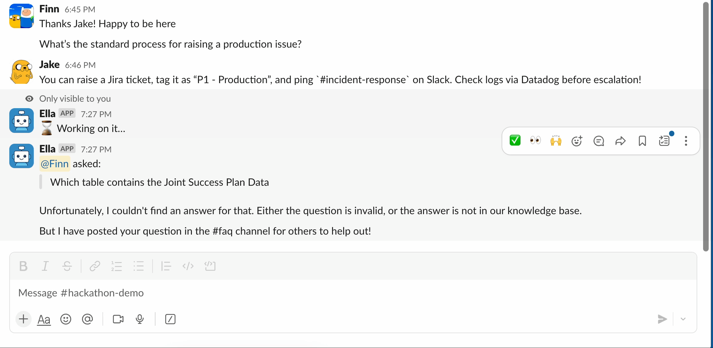

# Ella (Effortless Learning & Lookup Assistant)

Ella is an AI agent that helps you automatically transforms your team’s resolved chat threads into a living FAQ document so no question has to be answered twice.

## 60-Second Pitch

- ⚡ **Instant answers**: Ella searches its Knowledge Base built on historical conversations and replies in real time.
- 🙋 **Escalates smartly**: No answer? Ella posts the question to **#faq** channel so teammates can jump in.
- 🧠 **Self-learning**: Once solved, Ella stores the new Q&A, eliminating repeat questions.

## Full Deck Link:

- https://google-adk-hackathon-demo.my.canva.site/

## Architecture

High Level Workflow

Agent Level Workflow

### Demo GIF with a slack app integration

|                                          Stage 1                                          |                                       Stage 2                                       |
| :---------------------------------------------------------------------------------------: | :---------------------------------------------------------------------------------: |
| **Ask Ella → instant reply from knowledge base**          | **Agent sending unknown question → #faq**           |
| **Stage 3: Help is saved to knowledge base**              | **Stage 4: Repeated question auto answered**        |

## How It Works

1. **Ask** → User messages Ella.
2. **Search** → Ella scans the Knowledge Base.
3. **Answer / Escalate** → Replies instantly or posts to **#faq**.
4. **Learn** → Saves the new answer for next time.

- **Read Agent** forwards the question to Vertex AI (Gemini + RAG).
- Vertex AI pulls relevant documents from a Cloud Storage corpus, combines them with the LLM, and returns an answer.
- FastAPI delivers Ella’s reply back.
- If the user (or teammate) runs `/add_doc`, the **Write & Curate Agent** stores the new document in Cloud Storage, expanding the corpus that RAG searches next time.
## Running Locally
- [Link to Guide](https://github.com/mahima110298/ella/blob/main/local_setup.md)

## Contributing
Pull requests are welcome! 🌟
© 2025 Ella | All Rights Reserved
